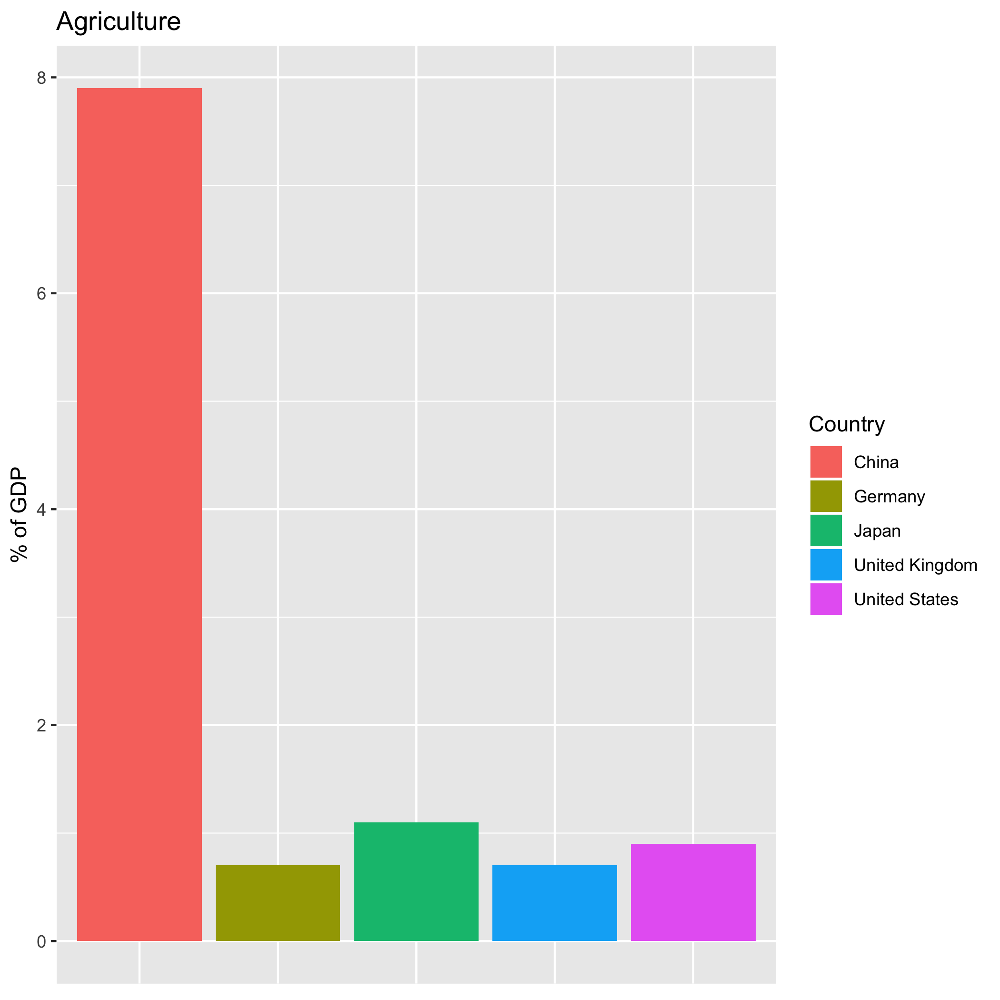
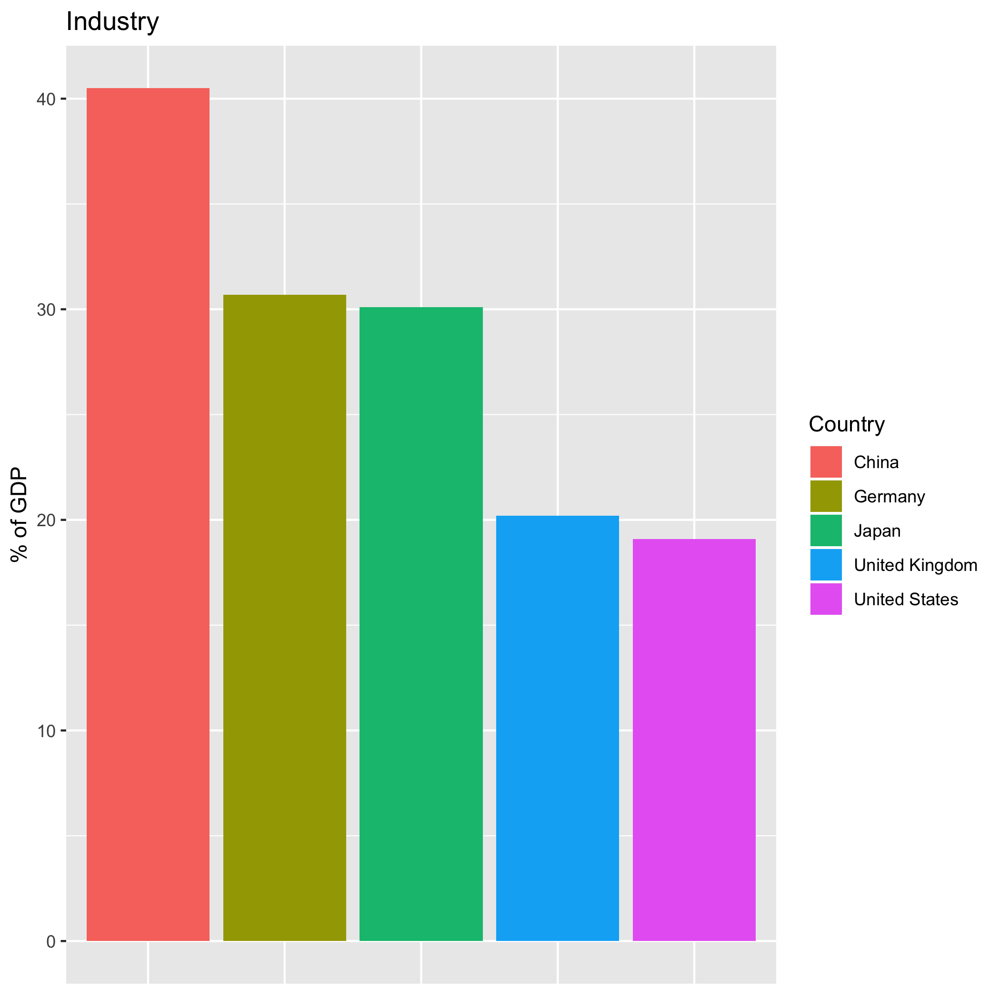
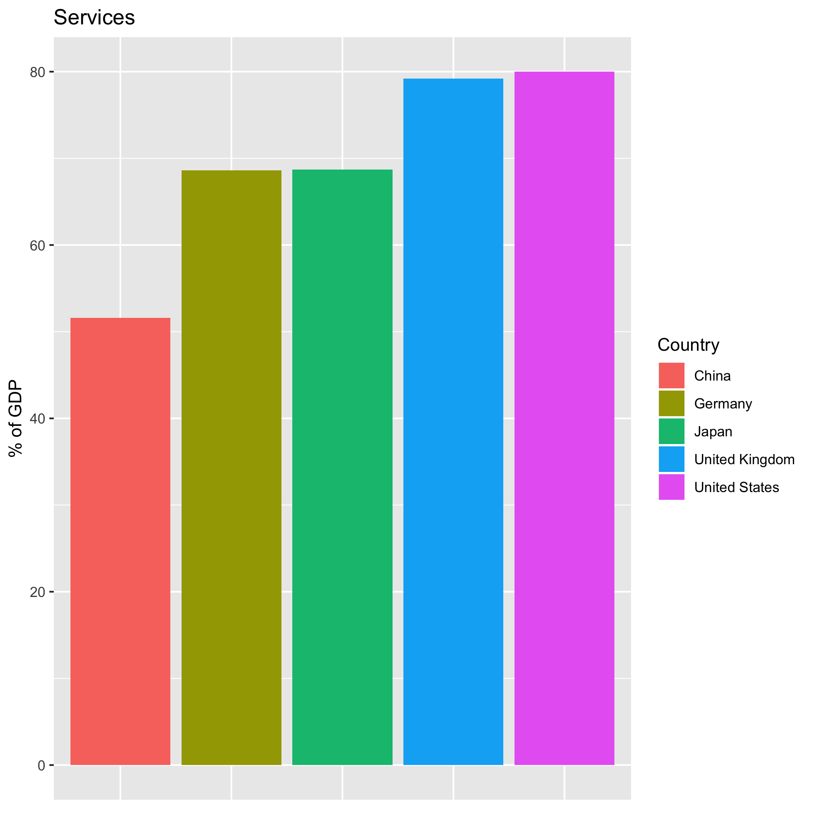

# Scraping-CIA-Economic-Data
Scraping data from CIA website regarding the breakdown of GDP by sector for various countries. I was interested in how the top five world economies compared in the distribution of GDP by sector and to practice scraping information from websites, so I took the relevant information from https://www.cia.gov/library/publications/the-world-factbook/fields/214.html#UK . 

